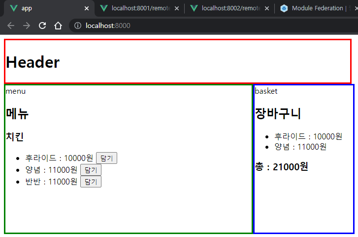

# Module Federation & Vue로 Micro Front-End 구축해보기

서비스 규모가 커짐에 따라 Front-End에서도 MSA를 적용하는 곳이 점점 많아지고 있다. 빌드 통합, 런타임 통합 등 방법도 다양하고 직접 바닐라 스크립트로 구현하거나 [single-spa](https://single-spa.js.org/) 같은 라이브러리를 이용하는 곳도 있다. 그리고 이번에 Webpack 5 버전에서 MSA를 지원하는 Module Federation이라는 피쳐가 추가 되었다. Module Federation이 뭔지 살펴보고 직접 사용해보자.

## Module Federation

Module Federation은 Webpack 5에 새로게 추가된 기능이다. Module Federation은 여러 분리된 빌드들로 하나의 어플리케이션을 구성할 수 있도록 해준다.
컴포넌트 또는 코드 단위로 빌드된 결과물을 단/양방향에서 공유하여 사용할 수 있다. 다른 빌드에 있는 코드를 동적으로 불러와서 사용할 수 있다. 개별 빌드는 서로 의존성이 없어서 개별적으로 개발하고 배포할 수 있다.

## 시작

Webpack 5 이전 버전은 별도로 플러그인을 설치해서 구현할 수 있지만 webpack 버전을 올린 후 적용하는걸 추천한다. 아래 순서대로 해볼 예정이다.

1. 프로젝트 세팅
2. Module Federation 및 remote/host 설정
3. Vuex 설정 및 스토어 공유

## 1. 프로젝트 세팅

### 1-1) 프로젝트 구조

총 3개 애플리케이션 모듈을 만들고 메인 모듈에서 메뉴, 장바구니 모듈을 remote 설정하여 구성해볼 예정

```
project
└─ app (메인 모듈)
└─ basket (장바구니 모듈)
└─ menu (메뉴 모듈)
```

### 1-2) 프로젝트 생성

먼저 프로젝트를 생성한다. 편의상 vue cli로 생성했고, webpack으로 직접 설정해도 된다.
최신 버전이 3이라 vue3로 설치하였다.

```
$ vue create app    -- 메인 모듈
$ vue create menu   -- 메뉴 모듈
$ vue create basket -- 장바구니 모듈
```


포트는 각각 8000(메인), 8001(메뉴), 8002(장바구니)로 설정했다.

```javascript
// vue.config.js
devServer: {
    port: 8000, // 8001, 8002
},
```

### 1-3) app(메인) 모듈

`app` 모듈은 컨테이너 같은 역할을 한다. 메뉴 모듈과 장바구니 모듈을을 메인에 심을 예정이다. menu 영역에 메뉴 모듈을 넣을거고, basket 영역에는 장바구니 모듈을 넣을거다. 화면은 아래처럼 구성한다.


App.vue

```javascript
<template>
  <div>
    <div>
      <div style="border: solid; border-color: red; width: 700px">
        <h1>Header</h1>
      </div>
    </div>

    <div style="display: flex; height: 300px">
      <div class="menu">menu</div>
      <div class="basket">basket</div>
    </div>
  </div>
</template>

<script>
import { defineComponent } from "vue";

export default defineComponent({
  name: "App",
});
</script>

<style>
.menu {
  border: solid;
  border-color: green;
  width: 500px;
  height: 100%;
}
.basket {
  border: solid;
  border-color: blue;
  width: 200px;
  height: 100%;
}
</style>
```

### 1-4) menu(메뉴) 모듈

`menu` 모듈은 메뉴를 제공하고 선택하는 역할을 한다. 화면은 아래처럼 구성한다.


Chicken.vue

```javascript
<template>
  <div>
    <h2>메뉴</h2>
    <h3>치킨</h3>
    <ul>
      <li v-for="(menu, index) in menus" :key="index">
        {{ menu.name }} : {{ menu.price }}원
        <button>담기</button>
      </li>
    </ul>
  </div>
</template>

<script>
import { defineComponent, reactive } from "vue";

export default defineComponent({
  name: "Chicken",
  setup() {
    const menus = reactive([
      { name: "후라이드", price: 10000 },
      { name: "양념", price: 11000 },
      { name: "반반", price: 11000 },
    ]);

    return { menus };
  },
});
</script>
```

### 1-5) basket(장바구니) 모듈

`basket` 모듈은 메뉴에서 담은 메뉴들을 출력하고 계산하는 역할을 한다. 화면은 이렇게 구성한다.


Basket.vue

```javascript
<template>
  <div>
    <h2>장바구니</h2>
    <ul>
      <li>후라이드 : 10000원</li>
      <li>양념 : 11000원</li>
    </ul>
    <h3>총 : 21000원</h3>
  </div>
</template>

<script>
import { defineComponent } from "vue";

export default defineComponent({
  name: "Basket",
});
</script>

```

## 2. Module Federation 및 remote/host 설정

### 2-1) Module Federation 설정

각 모듈 틀을 짰으니 이제 Module Federation을 이용하여 컴포넌트를 공유해보자. 공유하는 애플리케이션을 `remote`라 부르고 이것들 사용하는 곳을 `host`라고 부르기로 한다. 여기서 `app`이 host이고 `menu`, `basket` 모듈이 remote이다.

먼저 host(app 모듈) 웹팩 설정을 해보자.

```javascript
publicPath: "http://localhost:8000",
chainWebpack: (config) => {
  config.optimization.delete("splitChunks");
  config.plugin("module-federation-plugin").use(require("webpack").container.ModuleFederationPlugin, [
    {
      name: "main",
      remotes: {
        menu: "menu@http://localhost:8001/remoteEntry.js",
        basket: "basket@http://localhost:8002/remoteEntry.js",
      },
      shared: require("./package.json").dependencies,
    },
  ]);
},
```

- `name` : 현재 모듈명을 적어준다. 다른 애플리케이션과 중복을 피해야한다.
- `remotes` : 불러올 컨테이너의 경로이다.
- `shared` : 의존성 공유를 어떻게 할지 정의하는 설정이다. 현재 사용하는 라이브러리들을 공유하기로한다.

다음은 remote(menu, basket 모듈)의 웹팩 설정이다.

```javascript
// menu
publicPath: "http://localhost:8001",
chainWebpack: (config) => {
  config.optimization.delete("splitChunks");
  config.plugin("module-federation-plugin").use(require("webpack").container.ModuleFederationPlugin, [
    {
      name: "menu",
      filename: "remoteEntry.js",
      exposes: {
        "./Chicken": "./src/components/Chicken.vue",
      },
      shared: require("./package.json").dependencies,
    },
  ]);
},

// basket
publicPath: "http://localhost:8002",
chainWebpack: (config) => {
  config.optimization.delete("splitChunks");
  config.plugin("module-federation-plugin").use(require("webpack").container.ModuleFederationPlugin, [
    {
      name: "basket",
      filename: "remoteEntry.js",
      exposes: {
        "./Basket": "./src/components/Basket.vue",
      },
      shared: require("./package.json").dependencies,
    },
  ]);
},
```

remote 설정을 하고나서 remoteEntry.js로 들어가보면 exposes한 컨테이너가 보이는걸 확인할 수 있다.


### 2-2) remote 컴포넌트 사용하기

module federation에서는 엔트리를 비동기로 가져오는 것을 추천하고있다. `bootstrap.js`를 생성하고 `main.js`에서 이 파일을 엔트리로 가져오게 변경한다.

```javascript
// bootstrap.js
import { createApp } from "vue";
import App from "./App.vue";
createApp(App).mount("#app");

// main.js
import("./bootstrap");
```

그리고 `App.vue`에서는 remote가 떠있지 않을 수도 있기 때문에 `defineAsyncComponent`를 사용하여 비동기로 컨테이너를 불러와서 사용한다.

```javascript
<template>
  <div>
    <div>
      <div style="border: solid; border-color: red; width: 700px">
        <h1>Header</h1>
      </div>
    </div>

    <div style="display: flex; height: 300px">
      <div class="menu">
        menu
        <Chicken />
      </div>
      <div class="basket">
        basket
        <Basket />
      </div>
    </div>
  </div>
</template>

<script>
import { defineComponent, defineAsyncComponent } from "vue";

export default defineComponent({
  name: "App",
  components: {
    Chicken: defineAsyncComponent(() => import("menu/Chicken")),
    Basket: defineAsyncComponent(() => import("basket/Basket")),
  },
});
</script>
```

이제 아래처럼 메뉴와 장바구니 영역에 각 remote 컴포넌트들이 렌더된다.



## 3. Vuex 설정 및 스토어 공유

모듈간 상태를 공유해보자. `app` 모듈에 상태를 정의하고 `menu`와 `basket` 모듈에서 상태를 공유하는 방식으로 해보자. (실습용 모델이며 실제 서비스에서는 설계하기 나름이다.)

먼저 각 모듈에 vuex를 설치

```
yarn add vuex
```

`app` 모듈에 스토어 설정을 한다.

store/index.js

```javascript
import { createStore } from "vuex";
import basket from "./modules/basket";

export default createStore({
  modules: {
    basket,
  },
});

export { basket };
```

공유하여 사용하기 편하도록 스토어를 모듈화하였다. (namespace는 패스)

store/modules/basket.js

```javascript
export default {
  state: () => ({
    menus: [],
  }),
  mutations: {
    addMenu(state, value) {
      state.menus.push(value);
    },
  },
  getters: {
    menus(state) {
      return state.menus;
    },
    totalPrice(state) {
      return state.menus.reduce((sum, value) => sum + value.price, 0);
    },
  },
};
```

- `menus` : 장바구니에 담긴 메뉴들
- `addMenus` : 메뉴 추가
- `totalPrice` : 총 가격

bootstrap.js

```javascript
import store from "./store";
createApp(App).use(store).mount("#app");
```

이제 스토어를 다른 모듈들에서 사용할 수 있도록 exposes 설정한다.

```javascript
config.plugin("module-federation-plugin").use(require("webpack").container.ModuleFederationPlugin, [
  {
    name: "main",
    filename: "remoteEntry.js",
    remotes: {
      menu: "menu@http://localhost:8001/remoteEntry.js",
      basket: "basket@http://localhost:8002/remoteEntry.js",
    },
    exposes: {
      "./Store": "./src/store/modules/basket",
    },
    shared: require("./package.json").dependencies,
  },
]);
```

이제 각 모듈에서 이 스토어를 가져다가 사용하면된다. remotes에 `app` 모듈을 등록

```javascript
remotes: {
  main: "main@http://localhost:8000/remoteEntry.js",
},
```

각 `store/index.js`에 remote의 Store 등록

```javascript
import { createStore } from "vuex";
import basket from "main/Store";

export default createStore({
  modules: {
    basket,
  },
});
```

`menu` 모듈의 Chicken.vue 컴포넌트에는 장바구니 담기 addMenu를 붙이고

```javascript
<template>
  <div>
    <h2>메뉴</h2>
    <h3>치킨</h3>
    <ul>
      <li v-for="(menu, index) in menus" :key="index">
        {{ menu.name }} : {{ menu.price }}원
        <button @click="addMenu(menu)">담기</button>
      </li>
    </ul>
  </div>
</template>

<script>
import { defineComponent, reactive } from "vue";
import { useStore } from "vuex";

export default defineComponent({
  name: "Chicken",
  setup() {
    const menus = reactive([
      { name: "후라이드", price: 10000 },
      { name: "양념", price: 11000 },
      { name: "반반", price: 11000 },
    ]);

    const store = useStore();
    const addMenu = ({ name, price }) => store.commit("addMenu", { name, price });

    return { menus, addMenu };
  },
});
</script>
```

`basket` 모듈의 Basket.vue 컴포넌트에서는 불러와서 출력을 한다.

```javascript
<template>
  <div>
    <h2>장바구니</h2>
    <ul>
      <li v-for="(menu, index) in menus" :key="index">{{ menu.name }} : {{ menu.price }}</li>
    </ul>
    <h3>총 : {{ totalPrice }}</h3>
  </div>
</template>

<script>
import { defineComponent, computed } from "vue";
import { useStore } from "vuex";

export default defineComponent({
  name: "Basket",
  setup() {
    const store = useStore();
    const menus = computed(() => store.getters.menus);
    const totalPrice = computed(() => store.getters.totalPrice);

    return { menus, totalPrice };
  },
});
</script>

```

아래처럼 동작한다.


## 라우터 설정

라우터도 스토어와 마찬가지로 remotes에서 라우터를 공유해서 사용하면 된다.

## 참고

- https://webpack.kr/concepts/module-federation/
